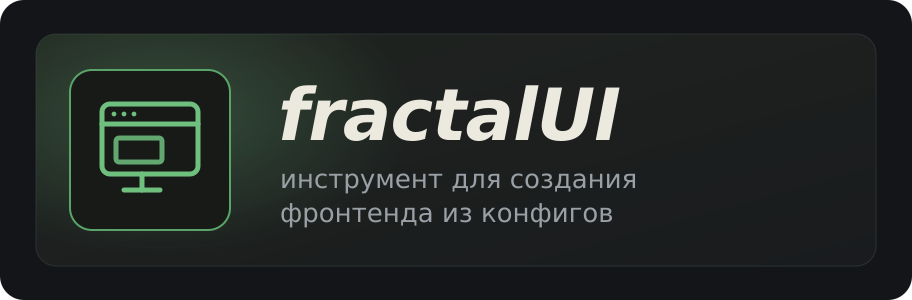

# fractalUI

**Слоистый headless React UI-кит с config-driven рантаймом сверху.** Доступные примитивы, которыми вы полностью управляете; готовые паттерны для целого app-shell; и — когда нужно — рендерер, собирающий экраны из обычного конфига. Библиотека для комплексной сборки веб-интерфейсов, нацеленная на понижение времени разработки.

<p>
  <a href="https://www.npmjs.com/package/@fractalui/primitives"></a>
  <a href="./LICENSE"></a>
  
</p>

## Слои

Каждый слой — отдельный npm-пакет, стоит на нижних и подключается независимо.

| Пакет | Что это |
| --- | --- |
| [`@fractalui/tokens`](packages/tokens) | дизайн-токены (vanilla-extract) — фундамент стилизации |
| [`@fractalui/icons`](packages/icons) | набор иконок |
| [`@fractalui/primitives`](packages/primitives) | headless доступные React-компоненты (Button, Tree, Table, BlockEditor, DatePicker…) |
| [`@fractalui/patterns`](packages/patterns) | составные паттерны: `AppShell`, `DockPanel`, `AutoTable`, `AutoForm` |
| [`@fractalui/runtime`](packages/runtime) | config-driven рендерер — экраны из данных |
| [`@fractalui/data`](packages/data) | утилиты данных для рантайма |

## Установка

```bash
npm i @fractalui/primitives @fractalui/tokens react-aria-components
```

```tsx
import "@fractalui/tokens/styles.css";
import "@fractalui/primitives/styles.css";
import { Button } from "@fractalui/primitives";

export function App() {
  return <Button onPress={() => alert("привет")}>Нажми</Button>;
}
```

## Документация

**https://0nliner.github.io/fractalUI/** — установка, быстрый старт, архитектура слоёв, темизация, паттерны и справочник по пакетам.

## Разработка (монорепа)

```bash
pnpm install     # ставит зависимости всех пакетов
pnpm build       # сборка всех пакетов (turbo → tsup)
pnpm dev         # watch-режим
```

Публикация в npm — через changesets: `pnpm changeset` → `pnpm version-packages` → `pnpm release`.

## Лицензия

MIT © [Aleksandr Chudaikin](https://github.com/0nliner) · Бюро автоматизации процессов
